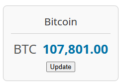
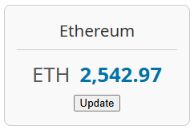
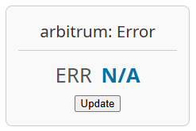

# Cryptocurrency Price API and WordPress Ticker

This repository contains two parts: a simple Cryptocurrency Price API built with Node.js and a WordPress plugin that displays a price ticker using the WordPress Interactivity API.

## Part 1: Cryptocurrency Price API

This API provides a single endpoint to get the name, symbol, and price of a cryptocurrency.

### Setup with Docker

To run the API using Docker, navigate to the `crypto-price-api` directory:

1. Create a `.env` file by copying the `.env.example` file: `cp .env.example .env`
2. Use Docker Compose to build and run the container:

```bash
cd crypto-price-api
docker-compose up --build
```

This will build the Docker image and start the container.

### API Endpoint

The API will be available at `http://localhost:3000`.

The endpoint to get the price of a cryptocurrency is `/price/{id}`, where `{id}` is the cryptocurrency ID (e.g., `bitcoin`, `ethereum`).

Example:

```
GET http://localhost:3000/price/bitcoin
```

Example Response:

```json
{
  "name": "Bitcoin",
  "symbol": "BTC",
  "price": 105800.00
}
```

## Part 2: Cryptocurrency Price Ticker WordPress Plugin

This plugin fetches data from the Cryptocurrency Price API and displays a price ticker in your WordPress theme using the Interactivity API.

**Note:** For this test task, the Server API URL is hardcoded in the plugin (http://localhost:3000)

### Installation

1. Clone this repository into your WordPress `wp-content/plugins/` directory.
2. Activate the "Crypto Price Ticker" plugin from the WordPress admin dashboard.

### Usage

The plugin provides a simple ticker display. To use it:

1. Ensure the Cryptocurrency Price API is running (see Part 1).
2. Edit the `crypto-price-ticker.php` file in the plugin directory.
3. The plugin displays Bitcoin price by default. To display a different cryptocurrency, locate the constant `CPT_CRYPTO_COIN_ID` and change its value to the ID of the cryptocurrency you want to display (e.g., `ethereum`):

```php
// In crypto-price-ticker.php
define('CPT_CRYPTO_COIN_ID', 'bitcoin'); // Change 'bitcoin' to the desired coin ID
```

4. The ticker is displayed in the theme's footer by default (using the `wp_footer` hook). It can also be displayed anywhere using the `[crypto_price_ticker]` shortcode.

### Examples

Here are examples of the ticker displaying prices for Bitcoin and Ethereum:





## Part 3: GitHub Repository

The complete code for both the API and the WordPress plugin is available in this GitHub repository.
